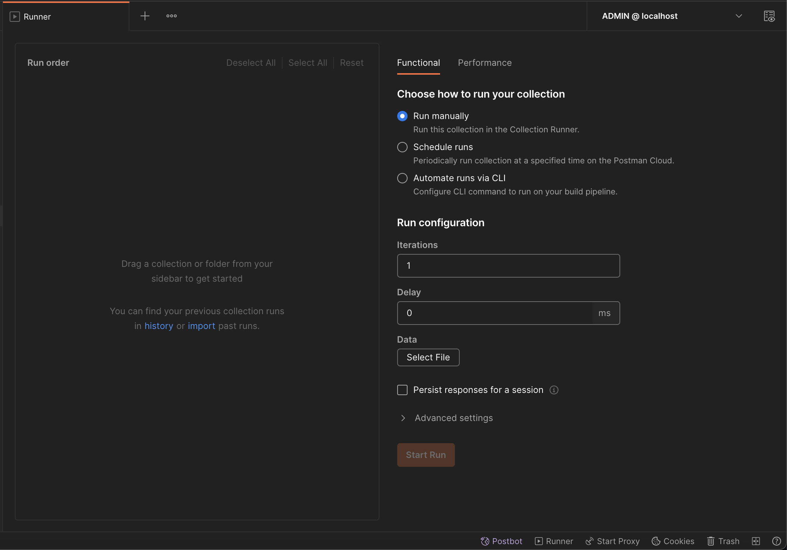

## Welcome to the GS1 Digital Link Resolver Community Edition v2.6

---

### ADVANCE NOTICE Community Edition v3.0 is on its way

- Please note that new v3.0 of GS1 Resolver is on its way with some breaking changes if upgrading from v2.x.
- This version 2.6 is the last version of the Community Edition v2.x series.

Version 3.0 Features:

1. **Upgraded and encrypted accounts / authentication system**. It's clear that the some members of the user community still wish
   to use GS1 Resolver's onboard (and very simple!) accounts system. It was designed to get people going before they embedded their
   own accounts/authentication system, but they like the simplicity, so we've designed a new accounts system with upgraded security,
   encryption of data at rest, and session tokens. However, we strongly recommend that you use your own accounts/authentication system.
   The new accounts system is designed to be a simple example of how to do it, and is not intended for production use.
   It is not a substitute for a proper security review of the code.
2. **IANA language becomes 'language'** and can support both language and territory within the same language code e.g. 'en-GB'.
   This is a breaking change with v2.x because the language code is no longer restricted to two characters in the SQL database.
3. **'active' flag property becomes 'public'** reflecting its actual use by the resolver service. 'public' links are those that are
   visible to the public, and 'public=false' links are those that are only visible to the owner of the link. This is a breaking change.

---

## Community Edition v2.6

Welcome! The purpose of this repository is to provide you with the ability to build a complete resolver service that
will enable you to enter information about GTINs and other GS1 keys and resolve (that is, redirect) web clients to their
appropriate destinations.

## Overview

The GS1 Digital Link Standard enables consistent representation of GS1 identification keys within web addresses to link
to online information and services.

In other words, GS1 Digital Link takes a barcode and turns it into a web address!

A GS1 Digital Link URI is a Web URI that encodes one or more GS1 Application Identifiers and their value(s) according to
the structure defined in this standard. So, for example, a product barcode (called its 'GTIN') value can be converted
into a consistently formatted web address which connects that product to online information about it.

GS1 is an organisation that defines a wide range of identifiers that underpin the supply chain and retail industry
across the world. These are known as 'GS1 Application Identifiers' a

A Resolver, in the context of a GS1 Digital Link, understands HTTPS requests conforming to the GS1 Digital Link
standard, and resolves - that is, 'smart redirects' - to an onward destination.

For an introduction to GS1 Digital Link, please watch this 9-minute video on YouTube from Phil Archer, Web Solutions Director, GS1 Global Office:  
<a href="https://youtu.be/H2idDJeH3o4">GS1 Digital Link Layer Cake</a>

## Security Audit results

Recently, one of our GS1 MOs kindly conducted a security audit of the GS1 Digital Link Resolver Community Edition. The results
are summarised here. Version 2.6 of the service includes updates where applicable.

1. **Inadequate authentication functionality**. The service uses a simple API key for authentication. This is not secure enough for a
   production environment. The service should be updated to use a more secure authentication mechanism such as OAuth 2.0.
   At GS1 Global Office we have long since updated our production service (the 'Links Registry') via the GS1 GO Developer Portal.
   The included date entry functionality in this project is a 'get you going' solution, and in any case the data entry service
   should be ideally behind a firewall and only available to your own applications. We will look at including session tokens
   in forthcoming v3.0 of this project, but really, you should use your own authentication mechanism.

2. **Users can override each others' data**. In the links database, the identificationKey and identificationKeyType fields define uniqueness.
   Any user can override an existing entry with the same identificationKey and identificationKeyType. This is one reason why we supply an empty validate()
   function in resolver_data_entry_server/validate.js where you can provide rules and consult with other systems to decide what any particular user can do.
   At GS1 Global Office we use validation calls to the GS1 License Registry so that MOs can only update their own licensed links.
   Even then, two more users from the same member organisation can override each other, just like they can with other sections of the GS1 Registry Platform.
   This is a feature, not a bug, thanks to the flexibility of the data design.

3. **HTML/JavaScript injection in upload web page and upload API**. The upload page now detects JavaScript included in the file that might be
   executed by the browser and warns the user. It's a new function detectJavaScriptCode() in **resolver_data_entry_server/public/javascripts/upload.js**
   and within the API at **resolver_data_entry_server/bin/resolver_utils.js** -
   included with a caveat that it is unlikely to be comprehensive and may occasionally cause 'false positives'. Your security team should review and assess it
   We no longer use the upload page in production, but it is still included in this project for your convenience.
   It is not a substitute for a proper security review of the code.

4. **Hard-coded user-ids password in the source code**. You will see hard-coded user-ids and passwords in the source code. These are for convenience
   only to get you going and should be changed in production. Nobody should be using SQL Server credentials 'sa' and 'its@SECR3T!' outside their own
   development environment! The example python clients include passphrases to show you what's possible with scripted interaction with the service.
   Look out for hard-coded usernames, passwords and/or passphrases in the following files:

- GS1_DigitalLink_Resolver_CE/resolver_sql_server/sqldb_create_script.sql
- GS1_DigitalLink_Resolver_CE/python_admin_clients/accounts.py
- GS1_DigitalLink_Resolver_CE/resolver_data_entry_server/Dockerfile
- GS1_DigitalLink_Resolver_CE/docker-compose.yml
- GS1_DigitalLink_Resolver_CE/resolver_sql_server/ ... in all files.

6. **Missing checks on redirect data**. The data entry APi now performs more comprehensive checks on the data being uploaded,
   ensuring that all provided properties are strings or booleans, and that no JavaScript can be present in targetUrl.

7. **Detection of vulnerable third-party libraries**. We have updated the packages so that we minimise any security vulnerabilities
   in the third-party libraries we use for Resolver. However, you should always check for the latest versions of these libraries. Useful
   services such as 'Snyk' can help you with this. See https://snyk.io/ for more information.

## Versions

### Version 2.6 Features

1. Various improvements resulting from feedback from the user community (thank you!)
2. Fixes resulting from the security audit (see above)
3. Improvements to UI (although we no longer use the UI in production, it is still included in this project for your convenience)
4. The codebase is backwards-compatible with existing v2.x data in SQL and MongoDB
5. New file installContainers.ps to help you set up the test environment automatically on an empty Windows box. This script was
   kindly authored by Sten Walde who is Product specialist Standards & Datamodels at GS1 Sweden. Thank you Sten!

### Version 2.5 Features

1. **New Application Identifier 417 (Party Global Location Number - PGLN)** has been added to the service. PGLNs are
   slightly different to standard GLNs because they identify an Organisation rather than just a location. Some smaller GS1
   members don't have locations as they trade in online marketplaces, but they would like a Party GLN which gives buyers
   links to customer service and FAQ information which is neither product nor Location related.
2. **Inclusion of Link Set standard** - this creates a neat JSON-based variant of the links data included in the Link:
   header so it is easier to consume by apps.
3. **GIAI (Global Individual Asset Identifier) entries** are different to GTINs because the serial number is in the GIAI
   identifier itself, rather than in a qualifier. Think of GIAIs (assets) as all the 'things' an organisation owns. If
   the organisation is a hospital, for example, everything in that hospital is an asset, so has a GIAI asset number that
   uniquely identifies it. How many assets are in a hospital? Thousands? Millions?? Today, every single one of them
   would have to be uploaded to Resolver, but from v2.5 only one entry is required. In this case just the prefix
   allocated to that member by their GS1 Member Organisation is needed for the uploaded GIAI value, and the target URL
   includes a special template variable which gets replaced by the serial number when a request comes into Resolver with
   a GIAI starting with the same prefix. We are looking to extend this functionality to two other Identifiers where the
   serial number is part of the identifier - GRAIs (returnable assets such as a lending library) and SSCCs (Serial
   Shipping Container Codes). If we can, we'll include these two next week, otherwise we will perform a further minor
   update in a month's time.
4. **New Dashboard service** - find out stats about your data in Resolver! This new functionality includes a new Dashboard
   container which performs hourly updates to its statistical data store so as not to put pressure on the database when
   it is live.
5. **Security audit updates to packages** so that we minimise any security vulnerabilities in the third-party libraries we
   use for Resolver.
6. **Various small bug fixes and performance improvements**, including upgrade to Node 16 on Alpine Linux 3.14

### Version 2.4 Features

1. **Various bug fixes** / code changes from trialists' feedback
2. **Performance improvements** to existing code
3. **Express routes** applied for GS1 Identifier Key Types: GTIN, GLN, GLNX, SSCC, GRAI, GIAI, GSRN, GDTI, GINC, GSIN, GCN,
   CPID, GMN
4. Changed all instances of defaultLink\* to **defaultLinkMulti**
5. **Compressed URIs** implemented
6. Updated rules that generate a **400 Bad Request**
7. **Updated Node from v15.1 on Alpine Linux 3.12 to v15.11 on Alpine Linux 3.13** to fix increasingly old version of npm as
   well as taking advantages of improved performance and bug fixes in Node V8 runtime.

### Version 2.3 Features

1. **New JSON output format** conforming to the IETF Linkset standard.
2. New extended format for Mongo documents that reduces the processing overhead of the resolving web server, thus
   improving performance.
3. New HTTP 303 'See Other' return code enabling clients to get more general info about an entry, if the specific lot or
   serial number is not present (part of the 'walking up the tree' functionality).
4. New HTTP 410 'Gone Away' return code if entry is present in the database but its 'active' flag is set to false (as
   compared to HTTP 404 'Not Found') when no entry exists at all.
5. Improvements to GS1 Digital Link Toolkit library.
6. Various bug fixes and improvements to the applications thanks to developer and trialists feedback.

### Version 2.2 Features

1. URI Template Variables - instead of using static values for qualifiers such as serial number, you can use a string
   value wrapped in curly braces like this: {myvar}. See the example in the CSV file resolverdata.csv in the 'Example
   Files To Upload'
2. Simplified linktype=all JSON document
3. New linktype=linkset JSON document
4. Massively reduced container image sizes. Using the latest version of Node and NPM with its updated packages, we can
   now run most of the service in the tiny Alpine Linux containers.
5. Better access to SQL via pooling - this makes better use of cloud-based databases such as SQL Azure (as well as
   dedicated databases)
6. Lots of optimisations, enhancements and security improvements.
7. Optimised for working in Kubernetes clusters - tested on DigitalOcean and Microsoft Azure Kubernetes offerings.

### Important Notes for existing users of previous versions 1.0 and 1.1

This is a brand new resolving architecture, not backwards compatible with version 1.0 or 1.1 as it is updated to reflect
big changes to the design and architecture of the service. These changes were to provide:

- More complete compliance with the GS1 Digital Link standard
- Performance and security improvements
- Rewrite of the id_web_server from PHP 7.3 to Node.JS v13.7
- Removal of separate Digital Link Toolkit server - now integrated into id_web_server
- Removal of experimental unixtime service (unixtime downloads will be revisited at later time)

If you are using earlier versions of Resolver, contact Nick Lansley (nick.lansley@gs1.org or nick@lansley.com) for advice on copying the data
from the old SQL format to the new much simpler SQL format. You should stop using the older v1.x service and transition
to this version as soon as possible.

## Upgrading

### Important Notes for existing users of previous version 2.0

The main upgrade of the service is to resolver_data_entry_server which has been upgraded to support batch uploading of
data and a validation process which you can optionally harness to check uploaded entries before they are published. This
has resulted in a data structure change that includes '\_prevalid' suffix named SQL tables into which data is uploaded. A
validation process is then kicked off which, if successful for each entry, copies the data into the non \_prevalid suffix
SQL tables.

To install this new update, make sure all your data is backed up(!), then use the 'docker-compose build' and '
docker-compose run -d' commands over the top of your existing installation, then run the SQL create script as documented
in Fast Start step 7 below. This will create a SQL database called "gs1-resolver-ce-v2-1-db" alongside your existing SQL
database "gs1-resolver-ce-v2-db" with the updated structure. The containers point to the new SQL database but the Mongo
database is unchanged and will continue serving existing data. You will have an extra step of copying data between the
databases but, apart from the \_prevalid tables, you will find the structure familiar. Note that a few column names have
been changed to conform better to GS1 naming conventions for data properties, but the data in the columns is unchanged
in format.

Note also that you only see one running instance of the resolver-web-server rather than five, unlike v2.0. The running
of multiple servers has become unnecessary thanks to the latest Node v14 V8 engine and a lot of code optimisation. Fast!

Finally, by popular request, docker-compose exposes the web service on port 80, no longer port 8080. It also exposes SQL
Server and MongoDB on their default ports, so use your favourite SQL Server client and Mongo DB to connect to localhost
with credentials supplied in the SQL and Mongo Dockerfiles.

### Important Notes for existing users of previous version 2.1

In v2.2 the new JSON format for linktype=all has been highly simplified and is a breaking change if you have a client
that expects the previous format. The unixtime batch format also uses the new format.

We have upgraded the security of the service in many ways. An important new environment variable in the Dockerfile of
resolver_data_entry_server is:

<pre>ENV CSP_NONCE_SOURCE_URL="localhost"</pre>

Wherever you run Resolver, you must change its domain name in this variable to match it's 'live' domain name, or else
the Data Entry UI JavaScript will be blocked from executing.

#### Emptying SQL table [server_sync_register] to initiate MongoDB rebuild:

The SQL database is unchanged, but we've greatly simplified the data stored in MongoDB. This changed document format is
smaller and simpler to both use and understand!
So you need to force the Build application to rebuild the Mongo database or the new Resolver web server won't understand
it. This is simple to do - using either the API or direct server access, empty the table
[gs1-resolver-ce-v2-1-db].[dbo].[server_sync_register]

For example, using the free SQL Server Management Studio, head into the database and use this command:

<pre>truncate table [gs1-resolver-ce-v2-1-db].[dbo].[server_sync_register]</pre>

- OR - Using the API with your Admin auth key, use the endpoint to list the servers:

<pre>curl --location --request GET 'https://resolver-domain-name/admin/heardbuildsyncservers'

[
  {
    "resolverSyncServerId": "qlh00O7z3JGk",
    "resolverSyncServerHostname": "build-sync-server-deployment-798854fb75-bvk4m",
    "lastHeardDatetime": "2020-06-15T08:35:12.840Z"
  }
]

</pre>

...then delete each server using its resolverSyncServerId value:

<pre>curl --location --request DELETE 'https://resolver-domain-name/admin/heardbuildsyncserver/qlh00O7z3JGk'</pre>

- OR - If you are running Resolver in Docker on your local machine, then you can use the docker volume command to remove
  the volume that Mongo stores its data in. Make sure that the service is completely down using <pre>docker-compose
  down</pre> then use this command:

<pre>docker volume ls</pre>

..and look for a volume that should be called 'gs1_digitallink_resolver_ce_resolver-document-volume'. You can then
delete it like this:

<pre>docker volume rm gs1_digitallink_resolver_ce_resolver-document-volume</pre>

Finally, build and restart the new service:

<pre>
docker-compose build
docker-compose run -d
</pre>

Mongo will initialise a fresh new empty database which the Build application will detect and perform a full rebuild.

### Important Notes for existing users of previous version 2.2

Just as for users upgrading to version 2.2, you will need to empty the table:

<pre>[gs1-resolver-ce-v2-1-db].[dbo].[server_sync_register]</pre>

Please follow the instructions for doing this in 'Important Notes for existing users of previous version 2.1' section '
Emptying SQL table [server_sync_register]' to initiate MongoDB rebuild of its data.

### Important Notes for existing users of previous version 2.3

No changes to data, so you can simply upgrade the code, and it will work with v2.3 data structures in SQL and Mongo.

If you started authoring client apps that use Resolver's linkset defaultLinkType\* array, you will need to refer to this
array with its new name defaultLinkTypeMulti. This change came about because of some syntax challenges using the
asterisk symbol, which could be converted to HTML code <b>\*</b> or HTML entity <b>\*</b>.

### Important Notes for existing users of previous version 2.4

No changes to data, so you can simply upgrade the code, and it will work with v2.4 data structures in SQL and Mongo. A
section on the new GIAI (asset) functionality is included further down this README.

## Documentation

Please refer to the document 'GS1 Resolver - Overview and Architecture.pdf' in the root of this repository. This README
contains a useful subset of information contained there, but please refer to that PDF for more complete reading.

## Architecture

The community edition of the GS1 Digital Link Resolver is an entirely self-contained set of applications, complete with
databases and services for data entry and resolving.

We chose a Docker-based <i>containerisation</i> or <i>micro-services</i> architecture model for GS1 Digital Link
Resolver for these reasons:

- The need for end-users to build and host a reliable application free from issues with different versions of database
  drivers and programming languages.
- Should a container fail (equivalent of a computer crash) the Docker Engine can instantly start a fresh copy of the
  container, thus maintaining service.
- It is simple to scale-up the service by running multiple instances of containers with load-balancing.
- Most cloud computing providers have the ability to host containers easily within their service platforms.

It is for these reasons that this type of architecture has become so popular.

This repository consists of seven applications which work together to provide the resolving service:

<table border="1">
<tr><th>Folder Name</th><th>Project</th></tr>
<tr><td>resolver_data_entry_server</td><td>The Data Entry service <b>dataentry-web-server</b> consisting of an API that provides controlled access to Create, Read, Update and Delete (CRUD) operations on resolver records, along with 
a web-based example user interface that allows easy data entry of this information (and uses the API to perform its operations). 
This project uses a SQL Server database to store information</td></tr>
<tr><td>build_sync_server</td><td>This service runs a 'Build' process once a minute (configurable in Dockerfile) that takes any changes to the data in the SQL database and builds a document for each GS1 key and value, which will be used by... </td></tr>
<tr><td>resolver_web_server</td><td>The resolving service <b>resolver-web-server</b> is completely re-written in Node.js for improved performance and scalability which can be used by client applications that supply a GS1 key and value according to the GS1 Digital Link standard. This service performs a high-speed lookup of the specified GS1 key and value, and returns the appropriate redirection where possible.</td></tr>
<tr><td>resolver_sql_server</td><td>The SQL database service <b>dataentry-sql-server</b> using SQL Server 2017 Express edition (free to use but with 10GB limit) to provide a stable data storage service for the resolver's data-entry needs.</td></tr>
<tr><td>resolver_mongo_server</td><td>The <b>resolver-mongo-server</b> MongoDB database used by the resolver.</td></tr>
<tr><td>dashboard_sync_server</td><td>This service runs a statistical process once a 120 seconds (configurable in Dockerfile) that builds up a data graph of the information saved in its database for display by authorised users</td></tr>
<tr><td>frontend_proxy_server</td><td>The frontend web server routing traffic securely to the other containers. Using NGINX, this server's config can be adjusted to support load balancing and more,</td></tr>
<tr><td>digitallink_toolkit_server</td><td>A library server available to all the other container applications that tests incoming data against the official reference implementation of the GS1 Digital Link standard. There is also external access capability though the /dltoolkit API path for clients wishing to test their GS1 Digital Link syntax, and also to compress a GS1 Digital Link URL.</td></tr>
</table>

#### Web Servers

The only outward-facing web server is <i><b>frontend-proxy-server</b></i> which proxies any client requests to the <b>/ui</b>
data entry web application and <b>/api</b> API service through to the <b><i>resolver_data_entry_server</i></b> which provides
both services. An additional <b>/dltoolkit</b> path directs traffic to the <i><b>digitallink-toolkit-server</i></b>.

All requests that are not /ui /api or /dltoolkit are sent to <b><i>resolver-web-server</i></b>

#### Build server

The BUILD server looks for changes in the SQL database and uses it to create documents in the MongoDB database.
This 'de-coupled' processing means that the data is simple to understand for date entry purposes, but is repurposed into
a more complex structure for highly performant resolving. MongoDB can perform high-speed lookups and is ideal for the
high-performance reading of data.

#### Data Entry API

The Data Entry API is published here: https://documenter.getpostman.com/view/10078469/TVejgpjz

#### Database servers

This repository includes two extra containers for SQL Server and MongoDB. These are included to help you get up and
running quickly to experiment and test the service. However, you are strongly advised to move to cloud-based versions -
especially for SQL server, and change the data connection strings as stored below. MongoDB can be left local as long as
the volume it stores data on can be made 'permanent'.

- <b>resolver_data_entry_server</b> stores the required SQL connection resolver_data_entry_server/Dockerfile
- <b>build_sync_server</b> stores both SQL and MONGO connection strings in build_sync_server/Dockerfile
- <b>the five resolverN-web-server</b> stores their MONGO (only) string in resolver_web_server/Dockerfile

#### Disk volumes

Five 'disk' volumes are created for internal use by the service database. Three <i><b>
resolver-sql-server-volume-db-</b></i> prefixed volumes stores the SQL database and <i><b>
resolver-document-volume</b></i>
stores the Mongo document data so that all the data survives the service being shutdown or restarted. A further
volume, <i><b>resolver-sql-server-dbbackup-volume</b></i> is used to store a backup of the SQL Server database.

#### SQL Server Database backup and restore

There are two _not-fully-tested-yet_ backup and restore scripts for the SQL Server. To backup the server:

<pre>docker exec -it  dataentry-sql-server  /bin/bash /gs1resolver_data/setup/gs1resolver_dataentry_backupdb_script.sh</pre>

.. and to restore it (there are issues with restore which are being worked on!)

<pre>docker exec -it  dataentry-sql-server  /bin/bash /gs1resolver_data/setup/gs1resolver_dataentry_restoredb_script.sh</pre>

### How Resolver decides which response to choose

When you examine Resolver's data structure, you will see that it is defined by seven unique attributes:

1. <b>Identification Key Type</b> (e.g. '01' for GTIN)
2. <b>Identification Key Value</b> (the GTIN's 14-digit barcode value (8-, 12- and 13-digit GTINs are zero-padded to
   make them 14-digits))
3. <b>Qualifier Path</b> (often just the root path "/" but GTINs can have CPVs, lot number and serial number in the
   path, each separated by "/")
4. <b>LinkType</b> (a word from the GS1 Web Vocabulary describing what sort of information is being requested. e.g.
   Product Info? User Manual?)
5. <b>Language</b> (which the information is authored in)
6. <b>Context</b> (which in Community Edition can be any appropriate data value - in GS1 GO Resolver this is 'territory'
   such as 'FR' for France)
7. <b>MimeType</b> or MediaType (how the information is formatted. e.g. 'text/html', 'application/json')

In relational data terms, the Identification Key Type, Identification Key Value, and Qualifier Path (1, 2, 3) form an '
entry' which can have one or more 'responses' based on unique combinations of LinkType, Language, Context and MimeType (4. 5, 6, 7).

For example, if I was scanning a medicine product because I would like to find the patient information leaflet:
I want the leaflet (linktype 'gs1:epil') in French (language 'fr') within the legal jurisdiction of Belgium (context '
BE') in PDF format (mimeType 'application/pdf').

Resolver will see if it can match this exact request, but can follow defaults if not all the information is available in
its database. Resolver follows these rules in order:
(Note that the default linkType is found first and used as Linktype value if no linktype is provided in the request. If
no default linktype flag is set at all for this entry, the linktype in the first response of the responses array is
chosen. Well, what else can it do?!)

1. Linktype, Language, Context and mimeType
2. Linktype, Language, Context and default mimeType
3. Linktype, Language and Context
4. Linktype, Language and default Context
5. Linktype and Language
6. Linktype and default Language
7. Linktype
8. _FAIL_ (404 even though we have an entry as there is nothing we can do. Logically this can only happen if there
   aren't any responses in the response array).

## New GIAI (asset) functionality

A number of end-users have contacted us about their user stories regarding Assets. An asset is an item of hardware owned
by an organisation, and is used by this organisation as it goes about its business. Office tables and chairs, computers, the
canteen kettle and microwave - all belong to an organisation and in many cases, each has a unique asset identifier. One
of the incoming user stories includes a large hospital wanting to add GS1 Digital Link QR codes to all its assets, so
they can be scanned by various audit and maintenance personnel, who want to know where items are, and repair them.

At GS1 our standards include the asset as a 'GIAI' - Global Individual Asset Identifier.  
<a href="https://www.gs1.org/standards/id-keys/global-individual-asset-identifier-giai">More info on GIAIs at the GS1
Global Office website here</a>.

This asset list can be as large as millions of individual items in one organisation, and until now, every one would need
to be uploaded to Resolver.

Take a look at this entry (which is included as example data in the SQL create script 'sqldb_create_script.sql' stored
in the 'resolver_sql_server' folder):

<pre>
{
      "identificationKeyType": "8004",
      "identificationKey": "95060001",
      "itemDescription": "Dal Giordano Medicinal Compound - the GIAI Asset!",
      "dateInserted": "2021-09-22T16:17:45.553Z",
      "dateLastUpdated": "2021-09-23T13:55:11.580Z",
      "qualifierPath": "/",
      "active": true,
      "responses": [
          {
              "linkType": "gs1:faqs",
              "ianaLanguage": "en",
              "context": "xx",
              "mimeType": "text/html",
              "linkTitle": "Asset FAQs (full GIAI)",
              "targetUrl": "https://dalgiardino.com/medicinal-compound/index.html?assetnumber={1}",
              "defaultLinkType": false,
              "defaultIanaLanguage": true,
              "defaultContext": true,
              "defaultMimeType": true,
              "fwqs": true,
              "active": true
          },
          {
              "linkType": "gs1:pip",
              "ianaLanguage": "en",
              "context": "xx",
              "mimeType": "text/html",
              "linkTitle": "Asset Information Page (just serial number)",
              "targetUrl": "https://dalgiardino.com/medicinal-compound/index.html?assetnumber={0}",
              "defaultLinkType": true,
              "defaultIanaLanguage": true,
              "defaultContext": true,
              "defaultMimeType": true,
              "fwqs": true,
              "active": true
          }
      ]
  }
</pre>

Given that GIAIs can be as long as 30 characters, that identificationKey": "95060001" seems a bit short.
That's because 95060001 is simply the prefix - we call it the Global Company Prefix or GCP - licensed by a GS1 member from their member organisation.

Take a look at the targetURLs in the responses.

"linkType": "gs1:faqs" has:

<pre>"targetUrl": "https://dalgiardino.com/medicinal-compound/index.html?assetnumber={1}"</pre>

The other for "linkType": "gs1:pip":

<pre>"targetUrl": "https://dalgiardino.com/medicinal-compound/index.html?assetnumber={0}"</pre>

Inside the targetUrl is a specially reserved template variable - either {0} or {1}

When Resolver receives a GIAI request starting with the GCP, it will find this document in the Mongo database. Since
it now knows that the part of the GIAI starting "95060001" must be the GCP, the rest of the GIAI must be this asset's
alphanumeric serial number.

So now Resolver finds the most appropriate response and retrieves the targetURL. If the targetURL includes a:

- {0} - this variable is replaced by only the serial part of the GIAI.
- {1} - this variable is replaced by the entire GIAI value.

Let's have a go:

<pre>
%> curl -I http://localhost/8004/95060001HELLOWORLD
HTTP/1.1 307 Temporary Redirect
...
Location: https://dalgiardino.com/medicinal-compound/index.html?assetnumber=HELLOWORLD
</pre>

That response was chosen because we passed no linktype in the request, so Resolver chose the default: gs1:pip.

So now let's make Resolver choose the other response, gs1:faqs

<pre>
%> curl -I http://localhost/8004/95060001HELLOWORLD?linktype=gs1:faqs
HTTP/1.1 307 Temporary Redirect
...
Location: https://dalgiardino.com/medicinal-compound/index.html?assetnumber=95060001HELLOWORLD&linktype=gs1:faqs
</pre>

Yes! We see the entire GIAI being redirected (and because "fwqs": true, the linktype itself gets forwarded as it was in
the query string part of the request)

Like big numbers? The longest that a GS1 GCP can be is 12 numeric characters. 30 - 12 means that 18 characters remain
for a unique serial value. Since serial value can consist of alphanumeric characters, each character can be (A-Z) 26 + (a-z) 26 + (0-9) 10 => 26 + 26 + 10 = 62. So that's 62-to-the-power-18 combinations. That's 1.833e+32, so we're likely
talking about putting a GS1 Digital Link QR code on every atom in the Universe!
And only one entry in Resolver! Nice.

Most GCPs are actually shorter than this, particularly where a GS1 member needs to generate thousands of GTIN product
codes. For each character count 'n' that a given GCP code is shorter than 12 characters, that's 62-to-the-power-'n' more
Universes that can have all their atoms affixed with GS1 Digital Link QR codes. That should cover most use cases.

## Install supporting software

We recommend the following software to use when getting to know GS1 Resolver and how it works:

1. <a href="https://docs.microsoft.com/en-us/sql/ssms/download-sql-server-management-studio-ssms?view=sql-server-ver15">
   SQL Server Management Studio</a> from Microsoft for Windows so you can see inside the SQL Server database.
2. <a href="https://www.mongodb.com/products/compass">MongoDB Compass</a> a client application from MongoDB Inc for
   exploring Resolver's database. Use this connection string to get connected:<pre>mongodb://gs1resolver:
   gs1resolver@localhost:
   27017/?authSource=admin&readPreference=primary&appname=MongoDB%20Compass&directConnection=true&ssl=false</pre>
3. <a href="https://www.postman.com/downloads/">Postman</a> API client which will work directly
   with <a href="https://documenter.getpostman.com/view/10078469/TVejgpjz">GS1 Resolver CE's API documentation</a>
4. <a href="https://www.jetbrains.com/idea/">Intellij IDEA</a> (Community (free) and Ultimate (licensed) editions) from
   Jetbrains or <a href="https://code.visualstudio.com/">Visual Studio Code</a> (free) supported by Microsoft - our
   chosen development environments which we have deliberately included config files for (.idea and .vscode) within the
   repo to help you get started quickly. Of course this repo will work with other fully featured IDEs!

## Fast start

#### Follow these instructions to get GS1 Resolver up and running on your machine complete with some example data.

1. Install the Docker system on your computer. Head to https://www.docker.com/products/docker-desktop for install
   details for Windows and Mac. If you are using Ubuntu Linux, follow install instructions
   here: https://docs.docker.com/install/linux/docker-ce/ubuntu/ - Note that if you wish to install on Windows Server
   editions, read the section on Windows Server at the foot of this README file.
1. Now you need to <i><b>git clone</b></i> this repository onto your computer. The web link is:<pre>https://github.com/gs1/GS1_DigitalLink_Resolver_CE.git
1. Open a terminal prompt (Mac and Linux) or PowerShell (Windows 10) and change directory to the one at the 'root' of
   your local cloned copy of this repository, so you can see the file <b>docker-compose.yml</b> in the current folder.
1. Type this command:<pre>docker-compose config</pre>...which should simply list the docker-compose.yml without error,
   and then type this command <pre>docker info</pre>
   which will get Docker to check that all is well with the service and provide some run-time statistics. You may seem
   some warnings appear, but if you're not seeing any errors then we're good to go.
1. Make sure you have a good internet connection, and then type this command:<pre>docker-compose build</pre>...which
   will cause Docker to build the complete end-to-end GS1 Resolver service. This will take only a short time given a
   fast internet connection, most of it taken up with downloading the SQL Server instance.

1. You are nearly ready to start the application. Before you do, make sure you have no SQL Server service (port 1433),
   MongoDB service (port 27017) or web server (port 80) running on your computer as they will clash with Docker as it
   tries to start the containers.

1. Let's do this! Run docker-compose with the 'up' command to get Docker to spin up the complete end-to-end
   application:<pre>docker-compose up -d</pre>(the -d means 'disconnect' - docker-compose will start up everything then
   hand control back to you).

1. Now wait 10 seconds while the system settles down (the SQL Server service takes a few seconds to initialise when '
   new') then, if you have SQL Server Management Studio installed, go to Step 9, else copy and paste this command which
   will cause you to enter the container and access its terminal prompt:<pre>docker exec -it resolver-sql-server bash</pre>
   Now run this command which will create the database and some example data:<pre>/opt/mssql-tools/bin/sqlcmd -S localhost -U sa -P its@SECR3T! -i /gs1resolver_sql_scripts/sqldb_create_script.sql </pre>
   You will see a messages such as '(1 rows affected)' and a sentences that starts 'The module 'END_OF_DAY' depends on
   the missing object...'. These are all fine - the latter messages are shown because some stored procedures are created
   by the SQL script before others - and some stored procedures depend on others not created yet as their creation
   occurs further down this SQL script. As long as the final line says 'Database Create Script Completed' all is well!
   Exit the container with the command:<pre>exit</pre>
1. ALTERNATIVELY to Step 8, if you have Windows and SQL Server Management Studio
   installed (<a href="https://docs.microsoft.com/en-us/sql/ssms/download-sql-server-management-studio-ssms?view=sql-server-ver15">download SSMS from here</a>), use it to connect to 'localhost' server, with username 'sa' and password 'its@SECR3T!'.
   Then, click on the 'New Query' button, and copy & paste the contents of 'sqldb_create_script.sql' in the '
   resolver_sql_server' folder into the Query window. Click 'Execute' and the script will run. Then, right-click '
   Databases' in the Object Explorer window and click 'Refresh' and you can see the new database '
   gs1-resolver-ce-v2-1-db'.
1. Head to http://localhost/ui and select the Download page.
1. In the authorization key box, type: "5555555555555" and click the Download button. Save the file to your local
   computer.
1. Click the link to go back to the home page, then choose the Upload page.
1. Type in your authorization key (5555555555555), then choose the file you just downloaded. The Upload page detects '
   Download' -format file and will set all the columns correctly for you. Have look at the example data in each column
   and what it means (read the final section of the PDF document for more details about these columns).
1. Click 'Check file' followed by 'Upload file'.
1. By now the local Mongo database should be built (a build event occurs every one minute) so try out this request in a
   terminal window: <pre> curl -I http://localhost/gtin/09506000134376?serialnumber=12345 </pre> which should result in
   this appearing in your terminal window:

<pre>
HTTP/1.1 307 Temporary Redirect
Server: nginx/1.19.0
Date: Mon, 09 Nov 2020 16:42:51 GMT
Connection: keep-alive
Vary: Accept-Encoding
Access-Control-Allow-Origin: *
Access-Control-Allow-Methods: HEAD, GET, OPTIONS
Access-Control-Expose-Headers: Link, Content-Length
Cache-Control: max-age=0, no-cache, no-store, must-revalidate
X-Resolver-ProcessTimeMS: 9
Link: &#60;https://dalgiardino.com/medicinal-compound/pil.html>; rel="gs1:epil"; type="text/html"; hreflang="en"; title="Product Information Page", &#60;https://dalgiardino.com/medicinal-compound/>;
rel="gs1:pip"; type="text/html"; hreflang="en"; title="Product Information Page", &#60;https://dalgiardino.com/medicinal-compound/index.html.ja>; rel="gs1:pip"; type="text/htm
l"; hreflang="ja"; title="Product Information Page", &#60;https://id.gs1.org/01/09506000134376>; rel="owl:sameAs"
Location: https://dalgiardino.com/medicinal-compound/?serialnumber=12345
</pre>

This demonstrates that Resolver has found an entry for GTIN 09506000134376 and is redirecting you to the website shown
in the 'Location' header. You can also see this in action if you use the same web address. In your web browser, you
should end up at Dal Giordano website. The rest of the information above reveals all the alternative links available for
this product depending on the context in which Resolver was called.

In this example, try changing the serial number - you will see it change in the resulting 'Location:' header, too! This
is an example of using 'URI template variables' to forward incoming requests into outgoing responses. This is a new
feature in Resolver CE v2.2 and later.

In the folder "Example Files to Upload" you will also find an Excel spreadsheet and CSV file with the same data - you
can upload Excel data too! This particular spreadsheet is the 'official GS1 Resolver upload spreadsheet' which is
recognised by the Upload page which sets all the upload columns for you. However, any unencrypted Excel spreadsheet
saved by Excel with extension .xlsx can be read by the upload page.

## Shutting down the service

1. To close the entire application down type this: <pre>docker-compose down</pre> Since the data is stored on Docker
   volumes, the data will survive the shutdown and be available when you 'up' the service again.
1. If you wish to delete the volumes and thus wipe the data, type these commands:

<pre>
docker volume rm gs1_digitallink_resolver_ce_resolver-document-volume
docker volume rm gs1_digitallink_resolver_ce_sql-server-dbbackup-volume
docker volume rm gs1_digitallink_resolver_ce_sql-server-volume-db-data
docker volume rm gs1_digitallink_resolver_ce_sql-server-volume-db-log
docker volume rm gs1_digitallink_resolver_ce_sql-server-volume-db-secrets
</pre>

If the above volumes are the only ones in your Docker Engine then it's quicker to type:<pre>docker volume ls </pre> to
confirm, then to delete all the volumes type:<pre>docker volume prune </pre>

## Fast Start: Kubernetes (Beta)

##### DISCLAIMER: These Kubernetes YAML scripts are currently under test and experimentation to get the best results.

Be careful if you run these scripts on a cloud service as it could cause them to create costly resources.
You need to be skilled and experienced with Kubernetes to continue! You can also run Kubernetes on your own computer -
these scripts have been tested with Docker Desktop for Windows 10 running in 'Kubernetes' mode.

The service is now ready for use with Kubernetes clusters. The container images are now maintained on Docker Hub and the
supplied YAML files in this repository will get you up and running quickly.

#### Update for v2.5: build-sync-server has been changed to run as a Kubernetes CronJob (see /k8s/build-sync-server.yaml) and is joined by the new dashboard-sync-service, also a CronJob.

1. Make sure you are pointing at the correct K8s cluster context:<pre>docker context ls</pre>
1. Run this command to get your cluster to install the images and build the complete K8s application:<pre>kubectl apply
   -k ./</pre>
   Note: It can take several minutes for the SQL Server pod to be set running. Until then expect 'ContainerCreating'
   status when you list the running pods. Use the command 'kubectl get pods' regularly until the SQL Server pod has
   status 'Running'. You are always recommended to use SQL Server in a separate cloud resource such as SQL Azure and not
   in a pod!
1. Once your cluster is up and running, you will need to run the SQL script to create the database with some example
   data. To do this, you need to find the SQL Server pod:<pre>kubectl get pods</pre>...and locate a pod with '
   sql-server' in its name, then use that name in this command:<pre>kubectl exec -it POD_name_containing_sql-server
   /bin/bash</pre>
   ...then once you have a command prompt inside the pod:<pre>/opt/mssql-tools/bin/sqlcmd -S localhost -U sa -P
   its@SECR3T! -i /gs1resolver_sql_scripts/sqldb_create_script.sql</pre>... and once that script has completed, exit the
   pod with:<pre>exit</pre>
1. Now you should follow steps 9 to 14 in the previous 'Fast Start' section to try out the service.
1. To shutdown the service use: <pre>kubectl delete -k ./</pre> ... which will delete all running pods and remove the
   data volumes.
1. You will see that the Kubernetes application is set up using a set of YAML files in the /k8s folder in this repo.
   Using the <b>kubectl apply -k ./</b> and <b>kubectl delete -k ./</b>
   commands, this accesses a file kustomization.yaml in the root folder that links to those files. However, you can make
   changes to individual YAML files to adjust the application then use the -f (file) command flag instead. For
   example:<pre>kubectl apply -f ./k8s/build-sync-server.yaml</pre>
1. Kubernetes provides a resilient and scalable system for managing Resolver; we use it to run Resolver at GS1 Global
   Office, so it is worth taking a look at this method of running your own Resolver service.

The main structural difference between the Kubernetes configuration for this project and our service at GS1 Global
Office is that

1. we use SQL Azure as a separate database service rather than having a version inside the cluster - the latter is not
   recommended as it takes up a huge amount of memory and CPU resources, and has no in-built backup capability!
2. MongoDB is used within our cluster as it provides a high performance read capability for the Resolver web server,
   since it is 'nearby' on the same internal network. However, rather than using a simple volume as set up by the YAML
   in this project, we use a Stateful Set which provide a resilient hot-backup of data should a node (virtual machine)
   in our cluster fail. With simple volumes, should the node crash, it will take a few seconds for Kubernetes to attach
   the Mongo data volume to a different node, causing an interruption in the service.

## Seeding the database with the postman runner

There is the Data Entry API of post man: https://documenter.getpostman.com/view/10078469/TVejgpjz. 
Please click link above to have our colection and api available to perform the following steps.

1. You need to create a csv file contain the data we need to insert into the database.
2. You add config environment global variable {{auth_key}} with current value is (5555555555555) and {{base_url}}
   with current value is (http://localhost).
3. You change body request api Create or Update Resolver Entries. For example:

   <pre>
   [
      {
         "identificationKeyType": "{{identificationKeyType}}",
         "identificationKey": "{{identificationKey}}",
         "itemDescription": "{{itemDescription}}",
         "qualifierPath": "/",
         "active": true,
         "responses": [
               {
                  "linkType": "{{linkType1}}",
                  "ianaLanguage": "en",
                  "context": "us",
                  "mimeType": "text/plain",
                  "linkTitle": "{{linkTitle1}}",
                  "targetUrl": "{{targetUrl1}}",
                  "defaultLinkType": false,
                  "defaultIanaLanguage": true,
                  "defaultContext": false,
                  "defaultMimeType": false,
                  "fwqs": false,
                  "active": true
               },
               {
                  "linkType": "{{linkType2}}",
                  "ianaLanguage": "en",
                  "context": "us",
                  "mimeType": "application/json",
                  "linkTitle": "{{linkTitle2}}",
                  "targetUrl": "{{targetUrl2}}",
                  "defaultLinkType": false,
                  "defaultIanaLanguage": true,
                  "defaultContext": true,
                  "defaultMimeType": true,
                  "fwqs": false,
                  "active": true
               }
         ]
      }
   ]</pre>

The json value {{example}} have similar the name of header column table in the csv file data.

4. You click runner in footer drag and drop the collection, select csv file click start run to. For example:

Then you will see the database change with the database you insert with the postman runner.

We hope you enjoy GS1 Resolver Community Edition!

Please be part of our Developers' forum at https://groups.google.com/g/gs1-digital-link-developers
where you can get the latest updates sent to your mailbox.

Best regards 
Phil Archer, Director, Web Solutions, GS1 
Nick Lansley, Lead Developer, GS1 Digital Link Resolver Project 
Rajesh Kumar Rana, Co-Developer, GS1 Digital Link Resolver Project 
