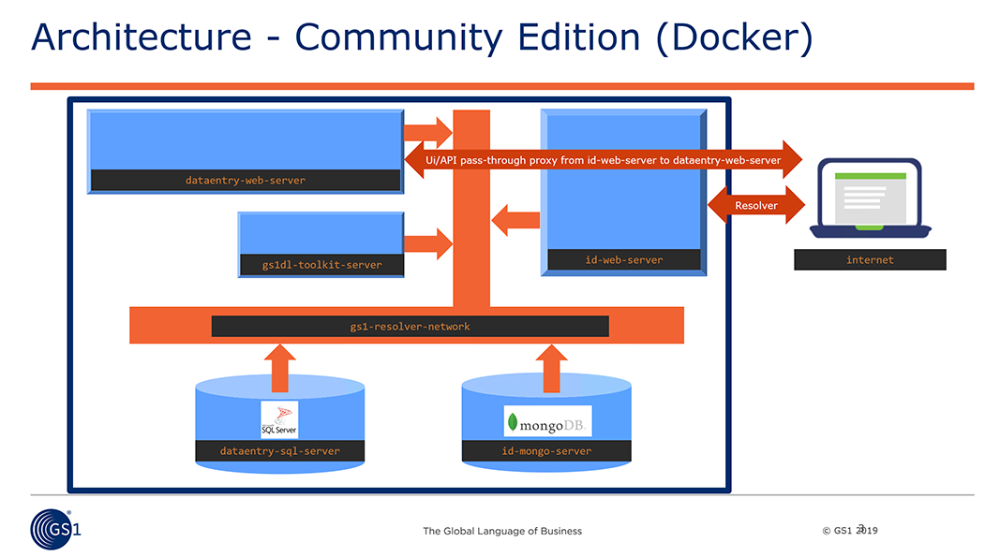

## Welcome to the GS1 Digital Link Resolver - Community Edition

Welcome! The purpose of this repository is to enable you to build a complete resolver service that will enable you to enter information about GTINs aand other GS1 keys
and resolve (that is, redirect) web clients to their appropriate destinations.

This repository consists of five projects which work together to provide the resolving service:
<table border="1">
<tr><td>data_gs1_org</td><td>The Data Entry service <b>dataentry-web-server</b> (as used on the domain <a href="https://data.gs1.org">https://data.gs1.org</a>) consisting of an API that provides controlled access to Create, Read, Update and Delete (CRUD) operations on resolver records. along with 
a web-based example user interface that allows easy date entry of this information (and uses the API to perform its operations). This
project uses a SQL Server database to store information, and the API has a 'Build' command that takes any changes to the database
and builds a document for each GS1 key and value, which will be used by.... </td></tr>

<tr><td>id_gs1_org</td><td>the resolver service <b>id-web-server</b> (as used on the domain <a href="https://id.gs1.org">https://id.gs1.org</a>) which can be used by client applications that supply a GS1 key and value according to digital link 
standards. This service performs a high-speed lookup of the wanted GS1 key and value, and returns the appropriate redirect where possible.</td></tr>

<tr><td>gs1resolver_dataentry_db</td><td>database service <b>dataentry-sql-server</b> using SQL Server 2017 Express edition (with 10GB limit) to provide a stable data storage
service for the resolver's data-entry needs.</td></tr>
<tr><td>gs1resolver_document_db</td><td>the <b>id-mongo-server</b> MongoDB database used by the resolver.</td></tr>

<tr><td>dl_toolkit_server</td><td>the <b>gs1dl-toolkit-server</b> service hosting a Node.JS (JavaScript) application running internally within the service to support id_gs1_org's ability to 
understand incoming digital ink requests.</td></tr>
</table>

## Architecture

The community edition of the GS1 Digital Link Resolver is an entirely self-contained service, completed with databases
and services for date entry and resolving.

The only outward-facing web server is the <i><b>id-web-server</b></i> container. Any client requests to the /ui/ data entry web application and /api/ API service are proxied through to the <b><i><b>dataentry-web-server</b></i></b> by the <i><b>id-web-server</b></i>. Any other calls to the service are processed by <i><b>id-web-server</b></i> itself.

A third web server, gs1dl-toolkit-server, is a separate service used internally by <i><b>id-web-server</b></i> to detect and create distinctive digital link elements which
<i><b>id-web-server</b></i> uses for further processing. Indeed, <i><b>gs1dl-toolkit-server</b></i> hosts a set of ten node.js (JavaScript) web servers across ten internal-only IP ports from 3000 to 3009 on the services' private <i><b>gs1-resolver-network</b></i>.
Processing threads in <i><b>id-web-server</b></i> can choose any of the ten ports at random, which speeds throughput given that each node.js endpoint is a single-threaded application.

As well as enabling CRUD (Create / Read / Update / Delete) operations on data, <i><b>dataentry-web-server</b></i> also has a BUILD function that runs once per minute as a result of the Docker HEALTHCHECK process set up in the Dockerfile for that container.
BUILD causes <i><b>dataentry-web-server</b></i> to look for changes in the SQL database and use it to create documents in the MongoDB database. MongoDB can perform high-speed lookups and is ideal for the high-performance reading of data.

Two 'disk' volumes are created for internal use by the service database. Volumes <i><b>gs1resolver-dataentry-volume</b></i> stores the SQL database and <i><b>gs1resolver-document-volume</b></i>
stores the Mongo document data so that all the data survives the service being shutdown or restarted (note that there is no backup service at this time).

## Fast start
1. Install the Docker system on your computer. Head to https://www.docker.com/products/docker-desktop for install details for Windows and Mac.
If you are using linux, follow install instructions here: https://docs.docker.com/install/linux/docker-ce/ubuntu/
2. Git Pull the repository onto your computer.
3. Open a terminal prompt (Mac and Linux) or PowerShell (Windows 10) and change directory to the one at the 'root' of this repository, so you can see
the file <b>docker-compose.yml</b> in the current folder.
4. Type this command:<pre>docker-compose config</pre>...which should simply list the docker-compose.yml without error, and then type this xommand <pre>docker info</pre>
which will cause docker to check that all is well with the service and give some run-time statistics. If you're not seeing any errors then we're good to go.
5. Make sure you have a good internet connection, and then type this command:<pre>docker-compose build</pre> which will cause Docker to build the complete end-to-end G1 Resolver service.
This will take quite a while with lots of text flowing up the terminal window as downloading and compiling of the service takes place. Even on a high speed
connection the build-from-scratch will take 10-15 minutes.
6. Once completed, type this to start everything up:<pre>docker-compose up</pre>As everything starts up, lots of text will once again flow up the terminal window.
Let it settle down.
7. Now open a second terminal / powershell window (you don't have to have this window in the same folder as the other terminal). At the new command prompt, type this command, which will run a program inside the SQL Server 
container, creating the database and some example data described in the file data_gs1_org/README.md <pre>docker exec -it  dataentry-sql-server  /opt/mssql-tools/bin/sqlcmd -S localhost -U sa -P feorfhgofgq348ryfwfAHGAU -i  /gs1resolver_data/setup/gs1resolver_dataentry_db_build_script.sql</pre>
8. Now take a browser and head to this web address: http://localhost:8080/ui and login as one of the test accounts described in:
 [date_gs1_org/README.md](data_gs1_org/README.md)
9. To close the service down, go back to the first terminal /powershell window and press Ctrl-C. This will shut the service down. 

## Next steps
* Read through the README.md and Dockerfiles for each project in this repository; many originate from when they were separate projects
and will prove interesting readinigs. Especially note the example data installed into the service when you run the SQL script - 
welcome to the world of <i>GS1 Westeros<i>!

