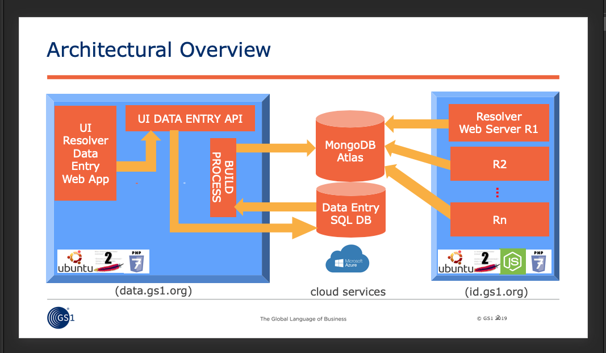

# GS1 Resolver UI and API Applications

## Overview
Welcome to the GS1 Resolver Data Entry service. This repository contains the applications that manage the data that underpins the requests and responses, and the creation of the MongoDB documents, that are used by the separate GS1 Resolver application.

Here are the various modules in their respective folders:
<table>
<tr><td>/api</td><td>JSON- and Form POST-aware data entry API, written in PHP 7.2</td></tr>
<tr><td>/ui</td><td>Reference data entry web application written in HTML and JavaScript (ECMA 6)</td></tr>
<tr><td>/wwwroot</td><td>home page that currently performs a server-side redirect to the /ui application</td></tr>
<tr><td>/config</td><td>A folder containing api.ini which has connection info for the databases.</td></tr>
<tr><td>/Setting up</td><td>Contains a SQL script for building the SQL Server database</td></tr>
<tr><td>/Docker config</td><td>configuration file(s) copied into the Docker image by Dockerfile</td></tr>
<tr><td>Dockerfile</td><td>Used to build an image for this complete application </td></tr>
</table>

This application saves data entered via a Web interface in an SQL database where it can be stored safely and accurately. A process task then checks, every minute, for changes to the data in the database, and uses those changes to build BSON (think: JSON!) documents which are then stored in a MongoDB document database for lightning retrieval by the separate GS1 Resolver application.

This repository covers the applications inside the data.gs1.org blue lozenge in the above diagram.

The two SQL Server and MongoDB databases can be located anywhere that can be accessed by the 
applications through the connection details stored in config/api.ini

The applications have been tested with SQL Azure and MongoDB Atlas cloud database services.

## Important
This group of applications is not a mandatory part of the GS1 Resolver service. They provide a data entry solution for building MongoDB (JSON-style) documents in a format the GS1 Resolver understands. However, if you are familiar with Document databases and follow the syntax rules for building GS1 Resolver documents, you can always find alternative means to translate your existing data directly to document format to store in MongoDB, bypassing this data entry application altogether. See the GS1 Resolver repository for details of the document storage format.

An alternative solution is to have your applications talk directly to the API application, and not use the Data Entry Web application. The API was designed from first principles to work with Product LifeCycle Management tools and Product Information Management applications. The simple syntax of the API means that you could use it to copy in your data in a controlled manner.

## Preparing for Installation
You are strongly advised to use containerisation to build this application. Docker images and the containers instantiated from them
are easy to support, scale up, scale-out, and are supported by all major cloud computing platforms. 
They have been tested on Kuberbetes clusters on cloud provider <i>Digital Ocean</i>, and Container Web Apps on <i>Microsoft Azure</i>.

Here's how to get up and running on your local machine first.
1. Install Docker Desktop for Windows here: https://hub.docker.com/editions/community/docker-ce-desktop-windows If you have Mac read here: https://docs.docker.com/docker-for-mac/install/ and for Linux follow these instructions: https://docs.docker.com/install/linux/docker-ce/ubuntu/
2. Set up the SQL Server database. If you don't have an on-premises SQL Server to hand, one option is to use a free tier SQL Server on a service like Microsoft Azure.
3. Copy and paste into the appropriate sections of file "docker/api.ini" the SQL Server machine domain name, the database name, user name and password created when you set up your SQL Server.
4. Upload and execute the SQL Server script in the "/Setting up" folder to build the database. You can add to an existing database 
if you wish, since the script installs a new schema called [gs1resolver_dataentry_db] which can sit alongside the more 
common [dbo] without affecting that existing schema. Read more at the top of the SQL script in the 'Setting up' folder.
5. You need to do the same with MongoDB. You are strongly recommended to use MongoDB Atlas which includes a free tier and is located at https://cloud.mongodb.com. You need to go through the process of creating a 'cluster' (a group of MongoDB databases in different locations that together form a resilient and high-performance service). Once the cluster is set up (which only takes a few minutes), you will be able to copy the full (and long!) connection string that starts "MongoDB://<your account name> ..." which you also paste into "docker/api.ini".
6. Unless you want to have a test/play with this repository on your local machine, now you need to consider the domain name of your GS1 Resolver endpoint where users, machines and apps will go to test GTINs and other GS1 keys. 
The entry to change is in config/api.ini and its called 'resolver_endpoint_url'. The reason for setting this value is that the data entry page has test function so you can test if any particular entry is active or not. 
7. Have a look through the Dockerfile in the root folder of this repository. Inside is a list of commands that Docker will use to build your image. If you are an experienced developer or DevOps, then most commands will be familiar to you. The Dockerfile has plenty of comments for each step, so you understand what is happening at each stage. 
8. In Dockerfile line 12, change the TZ TimeZone value to match yours, and check your language is included in the list of 'locales' on line 77
9. Also in the Dockerfile, read through how to set up the automated HealthCheck (also see 'automating the Build task' below).
10. Open docker_config/resolver_ui_api.conf and change the contact email address on line 9 from 'webmaster@gs1.org' to a suitable contact address for your organisation. This email is offered up by Apache2 should anyone need contact info. 
11. Open the api/iana_languages.json file which contains a list of all the supported IANA languages, and is made available through the API, and used by the Data Entry web application.
One of the many entries written in JSON - by default the "en" (English) entry - has an extra "default": "1" flag line. This means that for new entries, this language will be set as the default. You can move this line to any other language that you wish to have as default instead. Please make sure that the JSON syntax remains correct once you have moved this line, or the languages select box in the data entry application will be empty.
12. Open the file config/wellKnownRecordTemplate.json and change the information to that of
your own organisation. You can leave most entries, or change them after advise with the Digital Link team.
The specific items in wellKnownRecordTemplate.json to change are:
* "name" - your organisation's name and the name of the resolver.
* "resolverRoot" - the domain name of the server facing your users.
* "contact" - your contact details, where "fn" is your organisation name and "hasAddress" your official contact address.
* "hasTelephone" - contact telephone number for your organisation.
Make sure that you maintain the syntax-correctness of the JSON format.

13 . In ui/resolver.js at the top of that file is the opportunity for you to write a 'Welcome Message' when your users arrive to login to the data entry screen. Feel free to change: <pre>const welcome_message = "your message"</pre> ...to what ever message you wish.

## Installation
1. Open a Linux terminal window or Windows 10 / Windows Server PowerShell terminal window.
2. Change directory to the top folder of this repository. If you 'ls -l' (Linux) or 'dir' (Windows) you will see Dockerfile listed alongside the various folders, and this file README.md.
3. Type this command (including that full stop (period) at the end): <pre>docker build -t gs1resolver_ui_api .</pre>
4. If this is the first time you have built the image of this repository, it will take several minutes to download code and run all the commands. If you are rebuilding after a first run, it will be pretty quick.
5. From this image, we can create a container (an instance of the image we have just built, running as a virtual machine):<pre>docker run -d -p 8080:80 gs1resolver_ui_api</pre>
6. Let's try it! Open up a Web browser and go to this address: <pre>http://localhost:8080/api/test.php</pre>If your database connection strings are working, this page will let you know all is well and you should see these messages in your browser window.
 <pre>
  SQL Server Database connected OK - logging in as sansa.stark@gs1westeros.com with password Winteriscoming...
      
  Login success! Now to use the session key generated for Sansa Stark to access MongoDB...
      
  MongoDB Database connected OK! Everything looks perfect :-)
      
  System Test completed
      </pre>
 If not, review the errors and correct the connection strings in the repository's config/api.ini file. See below for info on stopping the container, adjusting files, and rebuilding the image. We'll continue as if all was well, but you can jump down the page to the Troubleshooting section.
7. The SQL Server script that you ran to create the database also added a test account that you can use to login now. Take your browser to <pre>http://localhost:8080/ui</pre>
...and login using fake email address <pre>sansa.starkw@gs1westeros.com</pre> with this exact password: <pre>Winteriscoming</pre> This account has global administrator capability, which we'll find useful later. What is important is that your instance of this application is working.
8. To shut down the container, we need to interrupt the docker run command line (press Ctrl-C to exit to terminal prompt - the container will remain running). Now type this command: <pre>docker container list</pre> which lists the one running container, like this (your list will have different values): <pre>
CONTAINER ID        IMAGE               COMMAND                  CREATED             STATUS                            PORTS                  NAMES
833884bd7575        gs1resolver_ui_api       "/usr/sbin/apache2ct…"   5 seconds ago       Up 4 seconds (health: starting)   0.0.0.0:8080->80/tcp   sleepy_neumann</pre> 
Select the container ID value (833884bd7575 in this case) and type this command:<pre>docker container stop 833884bd7575</pre> After a few seconds the container will shut down and return you the terminal prompt.

## Troubleshooting
If you saw errors when you tried the test page at <pre>http://localhost:8080/api/test.php</pre> then we need to find out what happened. Hopefully, the errors are caused by these issues:
* The connection string for MongoDB or the four SQL Server connection items were not entered properly into config/api.ini in which case you need to compare them to those given to you by the database service itself.
* A firewall at the database is preventing access from the internet network address of your computer. In MongoDB Atlas dashboard screen there is a 'Network Access' tab listing IP addresses that are allowed access. One of them should include the words "includes your current IP address". If not, then create a new entry, and your IP address will be offered up as one of those allowed access. If you are working from home or on a mobile cellular network connection, then your IP address is likely to change frequently, so the insecure option to allow access from all IP addresses is available. Use that option for dev and testing only!
* Something is misbehaving in your container and we need to take a look inside. If you arrived here as soon as you saw the errors, then your container is still running, giving you the opportunity to climb aboard and look for a specific errors-logging file. Go to your terminal window where you executed the 'docker run' command and type this command: <pre>docker container list</pre> which lists the one running container, like this (your list will have different values): <pre>
 CONTAINER ID        IMAGE               COMMAND                  CREATED             STATUS                            PORTS                  NAMES
 833884bd7575        gs1resolver_ui_api       "/usr/sbin/apache2ct…"   5 seconds ago       Up 4 seconds (health: starting)   0.0.0.0:8080->80/tcp   sleepy_neumann</pre>Select
 the Container ID value (in the above case, 833884bd7575) and use it in this command:<pre>docker exec -it b49a326929a3    /bin/bash</pre>
 This Docker command 'exec' enables you to run commands and programs inside the container. In this case, we are asking for the command '/bin/bash'  - the Linux terminal shell - to be run, and the '-it' means 'interactively'. The result is we now find ourselves <i>inside</i> the container, which is a small Ubuntu Linux virtual machine. Type this command: <pre>tail -f -n50 /var/log/apache2/error.log</pre>
 This is the log in which the application will put information and error messages in great detail. The tail command always looks at the end of a file, the '-n50' asks tail to display the last 50 lines, and the '-f' flag is telling tail to 'stay inside and keep watching'. 
 Now go back to your browser window where you see the error messages in test.php, and press the browser's refresh button.
 Now go back to the terminal window. What do you see? If you don't understand much of it then no problem, take a screenshot of the terminal window and please email to the support staff at the bottom of this document. Do check if you can see messages such as 'access denied' (login error) or 'unable to contact server' (connection string or firewall problem). Finally, press Ctrol_C to stop tail, then 'exit' to leave the container and return to your usual terminal prompt. You can also stop the container by reading the above instructions.
 
## Understanding and automating the BUILD task
The API includes a 'build' command. This runs the BUILD task, which looks for changes in the Data Entry SQL database and applies them
to the MongoDB document database. The reason for having these two very different database structures is:
* SQL databases are built to ensure well-structured data, data integrity and efficient data storage. There are well-defined standards for their use, and significant expertise in IT. This is why we have used a SQL database for data entry and storage.
* Document databases are designed for semi-structured and hierarchly-structured data and work best with data stored as name/value pairs. They are highly performant and have broader functionality. They are perfect for high speed lookups of data without having to join tables of data together as a SQL database would. This is why we have used a Document database for high speed resolver lookups.

In order for the BUILD task to perform its work, it must be triggered at regular time intervals; ideally once per minute. It is <i>not</i> designed to be triggered on demand or  immediately when data is altered in the SQL Server database, so as not to strain either database service in production. Under periods of high Resolver lookup load, the BUILD task frequency can be slowed in order for the MongoDB database to focus on serving up documents. 

<b><i>If you never trigger the BUILD task, then changes to entries made on the Data Entry application will never be applied to the MongoDB database and so will not go live on the Resolver endpoint.</i></b>

There are several ways to run a BUILD task:
* Use the 'HEARTBEAT' command in Dockerfile. The Dockerfile section on Heartbeat in this project details how to use Heartbeat once a minute, along with caveats for using this method.
* A CRON job or Windows Task Manager task set up on another machine that can 'see' the API and run this command ..where the  build_auth_key value matches the value in config/api.ini, and the URL is the address of your resolver Data Entry endpoint:
<pre>curl --header "Content-Type: application/json" --request POST --data '{ "command": "build", "build_auth_key": "ohf78qhrnhmrq8grnc97gc9wg7fmc79gfc9" }' https://www.example.com/api/api.php</pre>
* A LAMBDA or other 'serverless' task available from most cloud providers that can be triggered using time intervals. 
 
## Using the data entry screens
When you executed the SQL script, some test data was included for you to play with and get a sense of how everything works.
There are four test accounts, belonging to the fictional territory of GS1 Westeros, with two associated members: the Iron Islands and Castle Black in the North.
* Note that we have no connection with <i>Games Of Thrones</i>, our choice of this data was to make getting to know the resolver a little more approachable!
<table>
    <tr>
        <th>Account Name</th>
        <th>Login email</th>
        <th>Login password</th>
        <th>Belongs to member / role</th>
        <th>Has an existing resolver entry for you to edit?</th>
    </tr>
    <tr>
        <td>Sansa Stark</td>
        <td>sansa.stark@gs1westeros.com</td>
        <td>Winteriscoming</td>
        <td>Global resolver administrator for GS1 Westeros, an MO for the territory of Westeros. This account can set up other MOs, create Member companies and accounts for those members. In addition, this account can add and edit system data such as link-types, contexts and document types</td>
        <td>Yes</td>
    </tr>
    <tr>
        <td>Jon Snow</td>
        <td>jon.snow@castleblack.com</td>
        <td>Winteriscoming</td>
        <td>Member administrator for colleague account setup and entries belonging to Castle Black Security Ltd, a company whose GTINs are licensed from GS1 Westeros</td>
        <td>No</td>
    </tr>
    <tr>
        <td>Sam Tarly</td>
        <td>samwell.tarly@castleblack.com</td>
        <td>Winteriscoming</td>
        <td>Sam is an employee at Castle Black Security who can add and edit entries but cannot set up further accounts</td>
        <td>No</td>
    </tr>
    <tr>
        <td>Yara Greyjoy</td>
        <td>yara.greyjoy@ironislands.com</td>
        <td>Winteriscoming</td>
        <td>Member administrator for resolver entries and colleague account set-up for Iron Islands Axes and Tools Ltd, a company whose GTINs are licensed from GS1 Westeros</td>
        <td>Yes</td>
    </tr>
</table>

* <i>These logos were created by Nick Lansley from open source images as part of the test data. They are included in the 'member' table in base64 URL format and shown to data entry users when they login to the Web application. The images are not copyrighted except the GS1 logo which is a registered trademark of GS1 AISBL.</i>

## API commands and parameters
See /api/README.md for a list of API commands and functions

## Preparing for production
1. Delete ui/test.php
2. Set the domain name and path for the resolver correctly, so the data entry screen tests work
3. Empty the database of test data!
4. Follow instructions for uploading for hosting on Azure Web Apps (TODO)
5. Follow instructions for hosting in Kubernetes clusters provided by many cloud providers (TODO)
6. Review security considerations listed in the next section

## Security
As part of setting the application up for production, there are some important security considerations:
1. In the SQL Server database script, there is a function called PW_ENCRYPT(). This function is used by other stored
 procedures to create a one-way hash of an incoming cleartext password which is then used either to compare with an existing
 hashed password stored in the accounts table, or to write a new password into the accounts table, depending on the functions of
 the stored procedures. Untouched, PW_ENCRYPT() encrypts using a one-way hashing algorithm called 'SHA2_512'. You need to
  review this function and, if necessary, edit and install an appropriate one-way hashing algorithm that is consistent with your organisation's security policies and legal requirements. 
2. As a useful part of setting up and troubleshooting this application, the API has a command called 'serverinfo' which
will return a set of server metrics such as number of CPU cores, percentage memory utilisation and more. You are
strongly advised to disable or security-protect this API command when considering production deployment. You can
review the code in api.php (around line 448 at the time of authoring this README file) in order to decide what to do.
3. The database connection tasks at the top of PHP files ClassDBAccess.php and ClassMongoDB.php include debug information which 
you will find useful if you get issues connecting to the databases. You must remove these lines from production version of this app as this information would be useful for hackers.
4. /api/test.php allows you to test that your installation is up and running OK, but should be removed as soon as possible for the same reason given in 3.
## Support
email Nick Lansley nick@lansley.com or Phil Archer phil.archer@gs1.org
